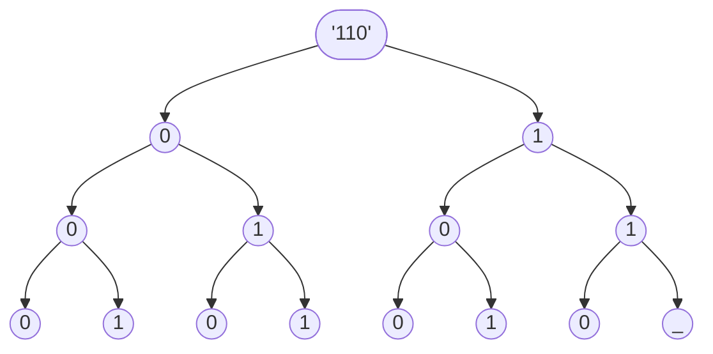
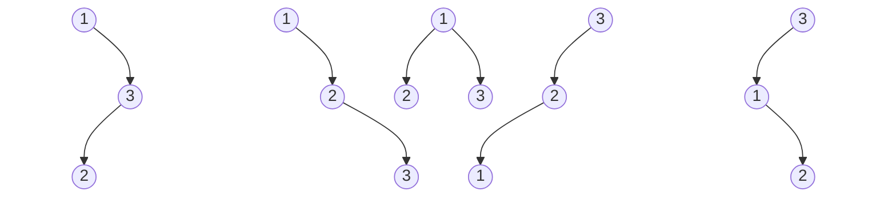

【摘要】为了提高算法的效率，动态规划是在算法实践中经常使用的一个思想，有些问题会非常适合使用动态规划的思想来设计算法。本文将借助LeetCode上的一些例子，来讲解和说明动态规划在算法案例中的一些实践。

【关键词】 动态规划 LeetCode 算法效率 算法
<!--more-->

# 一、引言

生活中会遇到很多的问题，在使用代码来进行抽象逻辑的时候，有时候会需要抽象成数学上的算法，来提高处理的效率。因为计算机的资源是有限的，并不能简单地、暴力地帮我们处理所有的问题。而且，很多重复的工作，也有必要通过抽象成算法来简化。比如举一个常见的例子，从1~n累加的和，就可以通过高斯算法来表示，得到(1+n)*n/2这样的结果，这样可以大大简化运算的步骤，从而提高算法的效率。同样的例子还有很多。算法可以有效的帮助到我们。

常用的有几大算法，分别是分治法、贪婪算法、动态规划、穷举法。当然还有一些分支定界法、回朔法、哈希表、深度优先搜索等等，在这里不做主要的介绍，在这里，主要介绍的是动态规划以及和动态规划思想有关算法的一些区别和需要注意的地方。

# 二、何为动态规划

动态规划（英文名称是：dynamic programming，这里的programing不是指程序代码，而是一种方法，一种算法思想）是解决某一类算法的思想，通过组合子问题的解，来求解最优解的方法。广泛应用在计算机科学、数学、生物信息学还有管理学科和经济学当中，通过把复杂的问题拆解成相对简单一些的子问题来求解。这样，通过分解成子问题，再通过子问题的最优集合，我们就可以方便的解决原来可能很复杂的问题。

关于子问题，有两个概念是需要了解的，第一个是最优子结构，动态规划要解决的，就是从一堆问题的解决方案中，寻找问题的最优解，当然这种最优解可能不存在，也可能用动态规划是无法寻找和找不到的。当找到最优解之后，通过把最优解拼装起来，就可以得到最后的解了。

如果问题比较复杂的话，那么非常有可能不止只有一个最优解，甚至，最优解也可以是一堆最优解的结合，这就是第二个关于子问题需要了解的，就是重复子问题。遇到这种情况，一般就需要通用递归重复子问题来得到最终的结果，当重复的子问题很多的时候，动态规划可以帮助我们减少很多重复的计算量。但是如果在使用递归方法来解决算法问题时，没有出现可以重复的子问题，那么就没必要非要使用动态规划的思想来解决，一般的递归方法也是可以很好地胜任的。

还有一个关于子问题的概念是，无后效性，也就是说每个子问题可以是相互独立的，在推导的过程中，后面的结果不该再去对这个子问题的结果产生影响。这一点也很重要，因为动态规划一般都是自顶向下来进行的，如果是子问题之间相互关联性很大的话，那就说明，这并不需要来通过动态规划来处理，也会严重影响到最后的算法的效率问题，或者这个算法有可能无法在有限的时间内终止，这都是不符合我们预期的。

我们可以这样说，寻找一个问题的子问题，并且完善子问题之间的关系的，写出状态转移方程，就是动态规划思想的基本思想过程了。也基本上可以说，如果能够证明，该问题存在最优的子问题，并且能够通过子问题的不断重复递归来得到最终的最优解，那么就说明该问题适合使用动态规划来解答。

以下通过几个案例，来详细解答这个过程。

# 三、案例一，不含连续1的非负整数

先来一道，关于数位动态规划的案例：
> 给定一个正整数n，找出小于或等于n的非负整数中，其二进制表示不包含连续的1的个数。[^1]

## 方法1. 最简单粗暴的方法

首先我们用最简单粗暴的方法来计算一下这个案例，代码如下：

```Java
class Solution {
    public int findIntegers(int n) {
        int result = n + 1;
        for (int i = n; i > 0; i--) {
            int nextNumber = i;
            int remainder = nextNumber % 2;
            while (nextNumber != 0) {
                int lastRemainder = remainder;
                nextNumber = nextNumber / 2;
                remainder = nextNumber % 2;
                if (lastRemainder == 1 && remainder == 1) {
                    result--;
                    break;
                }
            }
        }
        return result;
    }
}
```

以上方法，当输入是`2147483647`时，得到的结果是3524578，计算耗时为30063ms。 十进制转二进制的方法就是除二取余法，以上方法，从0~n，每个数都计算一遍，只要有出现连续的1，就在总数上减一，这样就可以得到最终的结果。

## 方法2. 使用动态规划的思想来解析

上面的方法最后的耗时显然是一个非常长的时间，那么我们该如何使用动态规划来分析这道题呢？按照暴力计算的思路，就是把全部的数都计算一遍，但显然没有这个必要去全部都去计算一遍。 举个例子，比如数字7，7转成二进制的数是`111`
，转成二进制表示的话： 0 : 000，1 : 001，2 : 010，3 : 011，4 : 100，5 : 101，6 : 110，7 : 111

以上符合条件的数，分别是`'0'`，`'1'`，`'10'`，`'100'`，`'101'`，一共5个数。我们可以把上面的数，使用二叉字典树的形式表达出来，如下图。



可以发现，里面是会有很多重复计算的，当数字小的时候，这点儿耗时可以忽略，但是当数字很大的时候，这种计算就会是非常耗时的，有着更多无意义的重复计算。 先观察可以发现，当右子树，连续出现两个1的时候，代表着后面的数全部都是不符合要求的。

也就是说，我们要计算的二进制表示中不含连续的1的数量，可以描述成要计算根节点为0的满二叉树中不含连续的1的路径数量。通过计算，我们可以列出来已知的一些结果。可以发现，要计算的根节点为0的满二叉树中不含连续1的路径数量，可以发现是上面2层不含连续1的路径数量之和。结果如下：

|          |          |          |          |          |
|----------|----------|----------|----------|----------|
| f(2^0)=1 | f(2^1)=1 | f(2^2)=2 | f(2^3)=3 | f(2^3)=5 |

我们依据斐波那契数列的关系，可以得出状态转移方程：

$$
f(2^n)= \begin{cases} f(2^{n-1})+f(2^{n-2})& \text{n}\geq{2}\ 1& \text{n}<{2}  \end{cases} 
$$

最后的代码如下：

```java
class Solution {
    public int findIntegers(int n) {
        List<Integer> data = new ArrayList<>();
        //添加斐波那契数列的初始值
        data.add(1);
        data.add(1);
        //利用斐波那契数列，计算出最大数的有效结果
        for (int i = 2; i <= n; i++) {
            int val = 1 << i;
            if (val >= 0 && val <= n) {
                data.add(data.get(data.size() - 1) + data.get(data.size() - 2));
            } else {
                data.add(data.get(data.size() - 1) + data.get(data.size() - 2));
                break;
            }
        }

        boolean haveOne = false;
        int result = 0;
        for (int i = data.size() - 1; i >= 0; --i) {
            // << 位移，用来表示在二进制上，1向左移动了几位，比如 1 << 2 的结果是100，也就是十进制的4
            int val = 1 << i;
            // &位与，二进制数上只有当都是1时，才为1，用来筛选出最高位的1所在的位置
            if ((n & val) != 0) {
                //把已经出现的左边树的数都加上
                result += data.get(i + 1);
                //如果出现连续的1，这里跳出循环，代表的下面的数都不会再符合条件
                if (haveOne) {
                    break;
                }
                haveOne = true;
            } else {
                haveOne = false;
            }
            if (i == 0) {
                //如果计算到了这里，需要再加1，因为0也是需要被计入符合条件的数字的
                ++result;
            }
        }
        return result;
    }
}
```

输出的结果，在同一台电脑，同样的配置下，当输入是2147483647时，得到的结果是3524578，计算耗时为20ms。可以看到，相比较直接的暴力计算，最终的性能有了非常大的提升。

# 四、案例二，不同的二叉搜索树

这是一道关于计数问题的动态规划的案例：
> 给你一个整数n，求恰由n个节点组成且节点值从1到n互不相同的二叉搜索树有多少种？返回满足题意的二叉搜索树的种数。[^2]

## 1. 什么是二叉搜索树
所谓的二叉搜索树，就是节点的左子树所有的值，一定小于该节点；右子树所有的值，一定大于该节点。比如，n=5时，可以得到：

## 2.方法一： 使用动态规划的思想来解析
要构建一颗二叉搜索树，我们可以把题目这样描述，给定一个有序的序列1\~n，遍历这个序列，对于每个数字i来说，把$i$当做根节点，把1~(i-1)当做左子树，把(i+1)~n当做右子树，接着递归遍历这两个序列，重复前面的操作，最后计数，就可以得到我们要的结果。因为一开始遍历的时候，根的值不一样，我们可以认为，通过这种方式构建出来的二叉搜索树都是唯一的。

接下来，我们定义两个函数，
1. $G(n)$: 把题目要求的有序的序列1~n，构建起来的不同二叉树搜索树的计数个数，也就是我们最终想要得到的结果，这里和输入的序列的内容无关，只要是序列里面的数都不同就可以了，n表示数量。
2. $F(i,n)$:以i为树的根，把1~(i-1)当做左子树，把(i+1)~n当做右子树构建起来的不同二叉树的计数个数，n表示数量，i表示根节点。

根据上面的描述，我们可以得到如下的公式：
$$
G(n)=\sum_{i=1}^{n}{F(i,n)} \tag{1}
$$

首先，我们定义当n=1，或者n=2时，$G(n)=1,  G(n)=2$。

接着，我们来计算$F(i,n)$，以i为树的根，计算的所有的二叉搜索树的集合，是左子树集合和右子树集合的笛卡尔积，再加上根节点之后，就构建成一颗二叉搜索树了。所谓的笛卡尔积就是在集合论中，两个集合中所有可能的有序对的集合。举例说明，一个序列[1,2,3,4,5,6]，以i=3，左边的序列[1,2]，右边的序列[4,5,6]。左边的序列，构建起来的二叉树搜索树的数量是$G(2)$，右边的序列，构建起来的二叉搜索树的数量是$G(3)$。这样我们就可以得到$F(3)=G(2) \cdot G(3)$。也就是说，我们会发现，因为$G(n)$其实和输入序列内容无关，只和输入的不同序列的数量有关系。所以，我们得到如下公式：
$$
F(i,n)=G(i-1) \cdot G(n-i) \tag{2}
$$
将上面的公式(1)和公式(2)，合并一下，就可以得到，我们想要的最终结果：
$$
G(n)=\sum_{i=1}^{n}G(i-1) \cdot G(n-i) \tag{3}
$$
据此，我可以写下如下的代码：
```java
class Solution {
    public long numTrees(int n) {
        long[] tree = new long[n + 1];
        tree[0] = 1;
        tree[1] = 1;
        for (int i = 2; i <= n; ++i) {
            for (int j = 1; j <= i; ++j) {
                tree[i] += tree[j - 1] * tree[i - j];
            }
        }
        return tree[n];
    }
}
```
当输入是35时，得到的结果是3116285494907301262，计算耗时为21ms。 以上就是我们的分析过程。

## 2.方法二：数学公式
从上面的推导，我们就可以发现，我们可以发现这是个数学上的公式，在数学上，我们上面推导出来的$G(n)$这个函数被称为卡塔兰数。具体的公式是：
$$
C_0=1,C_{n+1}=\frac{2(2n+1)}{n+2}C_n
$$

这是一个在组合数学上非常出名的公式。其实这个公式和上面的动态规划思想是一样的，只是直观地给出来最终的结果，这里就不对卡塔兰数进行证明了。我们会发现这个答案的解的结果是呈爆炸增长的。
 
# 五、动态规划与其他算法思想之间的关系

## 1. 分治策略

分治的思想是把一个问题分解成一系列的小问题，把问题的规模缩小到可以解决的程度，然后通过解决这些小问题，再合并之后，得到最终的结果。听上去和动态规划的想法是一样的。但其实是不一样的，动态规划是无数个无数个子问题的重复，是存在重复的子问题的。但是，分治思想是把问题拆解之后，变成一个个独立的小问题，并且和原问题描述是一致的，只是规模缩小了很多，再然后对计算结果进行合并，比如归并排序，就是把一堆的数组，平均的分成两半，然后在这两半里面进行排序，这就是典型的分治思想。还比如，快速排序，把数组随机的分成两半，然后不断地递归处理这些数组，来得到最终的结果，注意这里分成的这两半数是不一样的，而且还存在不断的递归，前面的子问题会影响到后面的子问题的情况。所以说，有没有重复子问题的出现，就是动态规划和分治最重要的差别。

如果一个问题可以通过拆解成独立的子问题，然后再把一堆的独立子问题再合并到一起，那么一般情况下，就可以考虑使用分治策略。但是如果这种拆解之后的子问题中包含很多公共子问题的话，那么，使用分治的效率就会低很多，因为这个时候，会有很多的重复的公共来浪费算法的性能，这种时候，使用动态规划来解决也许是个不错的选择。

## 2. 贪心算法

贪心算法，是比较于分治和动态规划简单一些的方法，说简单，并不是说这种方法实现起来不难，而是说，相比较于分治和动态规划，它的复杂度很低，也相对容易理解。而且分治和动态规划是要穷举并覆盖原问题所有的情况的，但是贪心算法是可以不用覆盖到所有的情况，只要能得出最优的结果，就可以结束了。贪心算法不要求存在最优的结果，而首先考虑的是局部最优，通过一系列的局部最优，在有些情况下就会得到全局最优，即便不是全局最优的，也一般不会是最差的结果，如果是可以通过求解局部最优就能得到全局最优的话，那一定是可以使用贪心算法的。

贪心算法的基本思路一般是，首先把原来的问题分解成若干个子问题，然后求解这些子问题，之后把这些子问题组合起来就得到最终的结果了。也同样的，贪心算法也要求，子问题是符合无后效性的，就是说，后面阶段的求解不会再去影响到前面结果的值，保证子问题的独立性。

举个例子，比如柠檬水找零找零问题[^3]，一个柠檬水摊上，一杯水5美元，一次购买一杯，按顺序找零，顾客支付的面额只有5美元，10美元，20美元，按顺序支付，当场点清。初始时，你没有一分钱，给你一串付款数字，判断是否能够最终找零。

这个问题就可以这样子来分析拆解。首先，如果给的是5美元，那可以直接收下，你的账户上5美元数量加一。然后，如果给的是10美元，那你只能找零5美元，然后你的户头上10美元的数量加一，5美元的数量减一。再然后，如果给的是20美元，有两种支付方式，一种是给一张10美元和一张5美元，一种是给三张5美元的，这样20美元的数量就加一，但是20美元并不能用于之后的支付，可以忽略，那就只需要统计10美元和5美元的数量即可，在这里，你需要尽可能使用第一种支付方式来支付，这样你手上的5美元数量会不断增加。

整个过程，后面的的顾客支付的数字，不会影响到前面的数字，只要依据这三种情况来分段支付即可，直到手上美元数量，无法再进行后续的支付。这个过程，就是使用到了贪心算法，而之所以使用到贪心算法，是因为面值的的大小固定在5美元，10美元，20美元这三种上面，并且是按照顺序来支付的，所以按照贪心算法的思想，并不需要去求解所有的情况，只需要当前的数字是否能够满足条件位置，直到需要求解的结果出来即可，也就是说局部的最优解，就是全局的最优解，这符合我们的预期。

分治策略、贪心算法和动态规划都和拆解子问题有关，区别只是关于子问题，有着不一样的要求，根据不同的分析，来解决实际中遇到的困难。分治和动态规划，都要求对最后得到的子问题全部解出来，但是贪心算法不需要，只要解到结果就可以了。贪心算法和动态规划，都要求设计的子问题是满足最优结构的，但是分治策略可以不是最优的子问题。

# 六、总结

本文主要通过两个案例来详细说明了动态规划是如何进行和思考的。案例一，是针对数位相关的动态规划的问题。在案例一中，我们会发现，使用动态规划的方法与单纯的使用暴力穷举法相比，性能有着非常大的提升。但这并不是说穷举法就没有效了。使用动态规划也是要穷举所有的子问题来处理的，但是当我们找不到合适的算法来解决问题时，使用简单暴力的穷举法，也可以成为我们的选择，虽然往往这样的情况下，会非常的耗时。

案例二，是关于计数相关的动态规划的问题。通过拆解子问题，划分成解决左子树和右子树的序列，就可以递归的得到最终的结果。当然这是分析的过程。所以说，动态规划是一个算法思想，是帮助我们理解和分析问题的算法思想，就和分治策略和贪心算法是一样的。合理使用算法思想是可以到帮助我们的。

同时，在最后要说一下，算法的分析方法有非常多的思路，不要局限在某个问题上，要合理应用，合理学习，这样才能更快更方便的得到问题的解。

# 参考文献

[1] Thomas H.Cormen, Charles E.Leiserson, Ronald L.Rivest, Clifford Stein：算法导论[M].殷建平，徐云，王刚，刘晓光，苏明，邹恒明，王宏志.
机械工业出版社，2012-12

[^1]: https://leetcode-cn.com/problems/non-negative-integers-without-consecutive-ones

[^2]: https://leetcode-cn.com/problems/unique-binary-search-trees/

[^3]: https://leetcode-cn.com/problems/lemonade-change